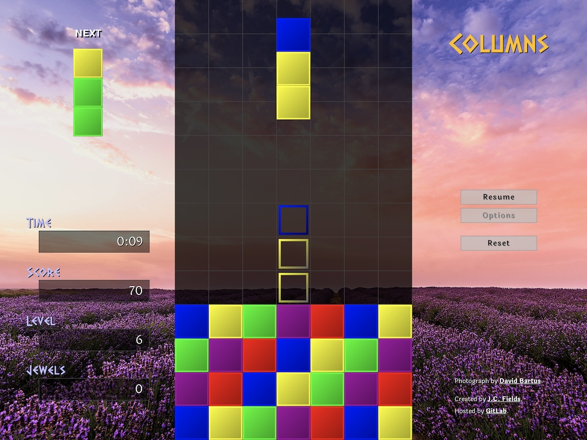

# columns

[*Columns*](https://jcfieldsdev.github.io/columns/) is a clone of the puzzle game of the same name. Written in JavaScript. *Columns* was originally released for the Sega Genesis and Game Gear in 1990.

## Guide

### Gameplay

*Columns* is a falling-block puzzle game similar to Tetris. Pieces consisting of three colored blocks fall into the well. Match three or more blocks of the same color in a row, column, or diagonally to eliminate them. The game ends when there is no more room in the well for additional blocks.

Because blocks fall under the effect of gravity when blocks underneath them are matched and cleared, it is possible to set up chain reactions for additional points. Each "wave" of a chain reaction increases the number of points rewarded multiplicatively. The *Score* field shows the current number of points.

The level of the game, visible in the *Level* field, increases when a certain number of blocks are eliminated, which also increases the rate at which pieces fall. The number of blocks that have been eliminated is tracked in the *Jewels* field.

Occasionally, a multi-colored "magic jewel" will fall. If it lands on a block, it will eliminate all blocks of that color from the well. If it lands on the bottom of the well rather than on a block, the player is awarded 10,000 points.

### Controls

Press the `Left`, `Right`, or `Down` arrow keys to move the piece. Press `Space` or `End` to immediately drop the piece to the bottom of the well.

Press the `Up` arrow key to rotate the colors of the piece.

Press the `Enter` key to pause or resume the game.

The `W`, `A`, `S`, and `D` keys can also be used instead of the arrow keys.

### Options

- **Colors**—This determines the number of possible jewel colors. More colors correspond to a higher difficulty level. The default is 5 colors.
- **Level**—The starting level. Pieces fall at a faster speed at higher levels. Each level also has a different background. There are 12 levels.
- **Height**—The starting height. This setting starts the game with the bottom of the well filled with rows of blocks. Playing in *Flash* mode requires at least two rows of blocks.
- **Mode**
  - The goal of the *Standard* mode is simply to play as long as possible and earn the greatest amount of points before losing.
  - In *Flash* mode, there is a flashing block in the bottom middle of the well. The game ends once this block is eliminated. Ranking on the high score table is determined by how quickly the block is eliminated.
  - In *Time Attack* mode, the timer counts down from 5 minutes. The challenge is to attain the highest score possible before the timer expires.
- **Backdrop**
  - *Photograph*—Shows a large photograph. This is the default for desktop users.
  - *Gradient*—Shows a randomly colored gradient. This is the default for mobile users.
- **Show ghost piece** toggles the guide piece, which shows where the current piece will land if dropped.

There is a separate high score table for each mode and for each difficulty level (i.e., number of colors).

## Acknowledgments

Uses [Dalek Pinpoint](https://www.k-type.com/fonts/dalek-pinpoint/) font by [K-Type](https://www.k-type.com/) and [Laila](https://github.com/itfoundry/laila) font by [Indian Type Foundry](https://github.com/itfoundry).

## Authors

- J.C. Fields <jcfields@jcfields.dev>

## License

- [MIT license](https://opensource.org/licenses/mit-license.php)

## See also

- [*Block Party*](https://github.com/jcfieldsdev/block-party)—Another puzzle game derived from this one.
